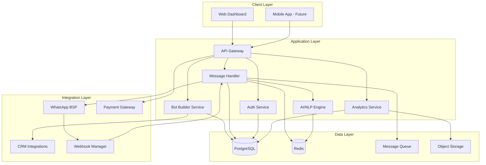

# BotFlow - Technical Implementation Plan

## Overview

This document outlines the complete technical architecture and implementation roadmap for BotFlow, a SaaS platform enabling businesses to create and manage AI-powered WhatsApp service agents.

---

## System Architecture

### High-Level Architecture



### Technology Stack

#### Frontend

| Component | Technology | Rationale |
|-----------|-----------|-----------|
| **Framework** | Next.js 14 (App Router) | SSR, SEO, performance, React ecosystem |
| **UI Library** | React 18 | Industry standard, rich ecosystem |
| **Styling** | TailwindCSS + shadcn/ui | Rapid development, consistent design |
| **State Management** | Zustand + React Query | Simple, performant, server state handling |
| **Forms** | React Hook Form + Zod | Type-safe validation, great DX |
| **Charts** | Recharts | Lightweight, customizable |
| **Bot Builder UI** | React Flow | Visual workflow designer |
| **Real-time** | Socket.io Client | Live message updates |

#### Backend

| Component | Technology | Rationale |
|-----------|-----------|-----------|
| **Runtime** | Node.js 20 LTS | JavaScript full-stack, async I/O |
| **Framework** | Fastify | Fastest Node.js framework, schema validation |
| **API Style** | REST + WebSockets | Standard REST for CRUD, WS for real-time |
| **Authentication** | Supabase Auth | Built-in auth, social logins, JWTs |
| **Database** | PostgreSQL 15 (Supabase) | Relational, ACID, JSON support |
| **ORM** | Prisma | Type-safe, migrations, great DX |
| **Caching** | Redis (Upstash) | Session storage, rate limiting, queues |
| **Message Queue** | BullMQ (Redis-based) | Reliable job processing, retries |
| **File Storage** | Supabase Storage | Media files, bot exports |

#### AI/NLP

| Component | Technology | Rationale |
|-----------|-----------|-----------|
| **LLM** | OpenAI GPT-4o | Best reasoning, function calling |
| **Fallback LLM** | Anthropic Claude 3.5 | Reliability, cost optimization |
| **Intent Recognition** | Custom fine-tuned model | Task-specific accuracy |
| **Embeddings** | OpenAI text-embedding-3 | Semantic search, knowledge base |
| **Vector DB** | Supabase pgvector | Integrated with main DB |
| **Translation** | Google Cloud Translation | Multi-language support |

#### Infrastructure

| Component | Technology | Rationale |
|-----------|-----------|-----------|
| **Frontend Hosting** | Vercel | Zero-config Next.js, edge network |
| **Backend Hosting** | Railway / Render | Easy deployment, auto-scaling |
| **Database** | Supabase | Managed Postgres, real-time, auth |
| **CDN** | Cloudflare | DDoS protection, caching |
| **Monitoring** | Sentry + PostHog | Error tracking, analytics |
| **Logging** | Axiom | Structured logs, fast search |
| **CI/CD** | GitHub Actions | Automated testing, deployment |

#### WhatsApp Integration

| Component | Technology | Rationale |
|-----------|-----------|-----------|
| **BSP Partner** | 360Dialog | Reliable, good pricing, SA support |
| **API** | WhatsApp Business Cloud API | Official Meta API, scalable |
| **Webhook Handler** | Fastify + BullMQ | Process messages asynchronously |
| **Media Handling** | Supabase Storage | Store images, videos, documents |

---

## Database Schema

### Core Tables

```sql
-- Users & Authentication
CREATE TABLE users (
  id UUID PRIMARY KEY DEFAULT gen_random_uuid(),
  email TEXT UNIQUE NOT NULL,
  full_name TEXT,
  avatar_url TEXT,
  created_at TIMESTAMPTZ DEFAULT NOW(),
  updated_at TIMESTAMPTZ DEFAULT NOW()
);

-- Organizations (multi-tenancy)
CREATE TABLE organizations (
  id UUID PRIMARY KEY DEFAULT gen_random_uuid(),
  name TEXT NOT NULL,
  slug TEXT UNIQUE NOT NULL,
  plan TEXT NOT NULL DEFAULT 'starter', -- starter, growth, professional, enterprise
  whatsapp_numbers TEXT[], -- Array of connected numbers
  subscription_status TEXT DEFAULT 'active',
  subscription_ends_at TIMESTAMPTZ,
  created_at TIMESTAMPTZ DEFAULT NOW(),
  updated_at TIMESTAMPTZ DEFAULT NOW()
);

-- Organization members
CREATE TABLE organization_members (
  id UUID PRIMARY KEY DEFAULT gen_random_uuid(),
  organization_id UUID REFERENCES organizations(id) ON DELETE CASCADE,
  user_id UUID REFERENCES users(id) ON DELETE CASCADE,
  role TEXT NOT NULL DEFAULT 'member', -- owner, admin, member
  created_at TIMESTAMPTZ DEFAULT NOW(),
  UNIQUE(organization_id, user_id)
);

-- WhatsApp Business Accounts
CREATE TABLE whatsapp_accounts (
  id UUID PRIMARY KEY DEFAULT gen_random_uuid(),
  organization_id UUID REFERENCES organizations(id) ON DELETE CASCADE,
  phone_number TEXT UNIQUE NOT NULL,
  display_name TEXT,
  business_account_id TEXT, -- Meta WABA ID
  phone_number_id TEXT, -- Meta Phone Number ID
  access_token TEXT, -- Encrypted
  webhook_verify_token TEXT,
  status TEXT DEFAULT 'pending', -- pending, active, suspended
  created_at TIMESTAMPTZ DEFAULT NOW(),
  updated_at TIMESTAMPTZ DEFAULT NOW()
);

-- Bots (Service Agents)
CREATE TABLE bots (
  id UUID PRIMARY KEY DEFAULT gen_random_uuid(),
  organization_id UUID REFERENCES organizations(id) ON DELETE CASCADE,
  whatsapp_account_id UUID REFERENCES whatsapp_accounts(id) ON DELETE CASCADE,
  name TEXT NOT NULL,
  description TEXT,
  task_type TEXT NOT NULL, -- booking, order_tracking, faq, lead_generation, etc.
  is_active BOOLEAN DEFAULT true,
  configuration JSONB NOT NULL DEFAULT '{}', -- Bot-specific settings
  ai_model TEXT DEFAULT 'gpt-4o',
  ai_temperature DECIMAL(2,1) DEFAULT 0.7,
  fallback_behavior TEXT DEFAULT 'human_handoff',
  created_at TIMESTAMPTZ DEFAULT NOW(),
  updated_at TIMESTAMPTZ DEFAULT NOW()
);

-- Bot Workflows (Visual flow builder)
CREATE TABLE bot_workflows (
  id UUID PRIMARY KEY DEFAULT gen_random_uuid(),
  bot_id UUID REFERENCES bots(id) ON DELETE CASCADE,
  name TEXT NOT NULL,
  nodes JSONB NOT NULL DEFAULT '[]', -- React Flow nodes
  edges JSONB NOT NULL DEFAULT '[]', -- React Flow edges
  is_published BOOLEAN DEFAULT false,
  version INTEGER DEFAULT 1,
  created_at TIMESTAMPTZ DEFAULT NOW(),
  updated_at TIMESTAMPTZ DEFAULT NOW()
);

-- Conversations
CREATE TABLE conversations (
  id UUID PRIMARY KEY DEFAULT gen_random_uuid(),
  organization_id UUID REFERENCES organizations(id) ON DELETE CASCADE,
  bot_id UUID REFERENCES bots(id) ON DELETE SET NULL,
  whatsapp_account_id UUID REFERENCES whatsapp_accounts(id) ON DELETE CASCADE,
  customer_phone TEXT NOT NULL,
  customer_name TEXT,
  status TEXT DEFAULT 'active', -- active, resolved, handed_off
  assigned_to UUID REFERENCES users(id), -- For human handoff
  metadata JSONB DEFAULT '{}',
  started_at TIMESTAMPTZ DEFAULT NOW(),
  ended_at TIMESTAMPTZ,
  created_at TIMESTAMPTZ DEFAULT NOW(),
  updated_at TIMESTAMPTZ DEFAULT NOW()
);

-- Messages
CREATE TABLE messages (
  id UUID PRIMARY KEY DEFAULT gen_random_uuid(),
  conversation_id UUID REFERENCES conversations(id) ON DELETE CASCADE,
  whatsapp_message_id TEXT UNIQUE,
  direction TEXT NOT NULL, -- inbound, outbound
  message_type TEXT NOT NULL, -- text, image, video, document, audio, location, etc.
  content TEXT,
  media_url TEXT,
  metadata JSONB DEFAULT '{}',
  status TEXT DEFAULT 'sent', -- sent, delivered, read, failed
  sent_by TEXT, -- bot, human, system
  sent_by_user_id UUID REFERENCES users(id),
  created_at TIMESTAMPTZ DEFAULT NOW(),
  updated_at TIMESTAMPTZ DEFAULT NOW()
);

-- AI Context & Memory
CREATE TABLE conversation_context (
  id UUID PRIMARY KEY DEFAULT gen_random_uuid(),
  conversation_id UUID REFERENCES conversations(id) ON DELETE CASCADE,
  context_data JSONB NOT NULL DEFAULT '{}', -- Extracted entities, user preferences
  summary TEXT, -- AI-generated conversation summary
  embedding VECTOR(1536), -- For semantic search
  created_at TIMESTAMPTZ DEFAULT NOW(),
  updated_at TIMESTAMPTZ DEFAULT NOW()
);

-- Knowledge Base
CREATE TABLE knowledge_base_articles (
  id UUID PRIMARY KEY DEFAULT gen_random_uuid(),
  organization_id UUID REFERENCES organizations(id) ON DELETE CASCADE,
  title TEXT NOT NULL,
  content TEXT NOT NULL,
  category TEXT,
  tags TEXT[],
  embedding VECTOR(1536), -- For semantic search
  is_published BOOLEAN DEFAULT true,
  created_at TIMESTAMPTZ DEFAULT NOW(),
  updated_at TIMESTAMPTZ DEFAULT NOW()
);

-- Templates (WhatsApp Message Templates)
CREATE TABLE message_templates (
  id UUID PRIMARY KEY DEFAULT gen_random_uuid(),
  organization_id UUID REFERENCES organizations(id) ON DELETE CASCADE,
  whatsapp_account_id UUID REFERENCES whatsapp_accounts(id) ON DELETE CASCADE,
  name TEXT NOT NULL,
  category TEXT NOT NULL, -- marketing, utility, authentication
  language TEXT DEFAULT 'en',
  template_content TEXT NOT NULL,
  variables JSONB DEFAULT '[]',
  status TEXT DEFAULT 'pending', -- pending, approved, rejected
  meta_template_id TEXT, -- Meta's template ID
  created_at TIMESTAMPTZ DEFAULT NOW(),
  updated_at TIMESTAMPTZ DEFAULT NOW()
);

-- Analytics & Metrics
CREATE TABLE conversation_metrics (
  id UUID PRIMARY KEY DEFAULT gen_random_uuid(),
  organization_id UUID REFERENCES organizations(id) ON DELETE CASCADE,
  bot_id UUID REFERENCES bots(id) ON DELETE CASCADE,
  date DATE NOT NULL,
  total_conversations INTEGER DEFAULT 0,
  resolved_conversations INTEGER DEFAULT 0,
  handed_off_conversations INTEGER DEFAULT 0,
  avg_resolution_time_seconds INTEGER,
  total_messages_sent INTEGER DEFAULT 0,
  total_messages_received INTEGER DEFAULT 0,
  customer_satisfaction_score DECIMAL(3,2),
  created_at TIMESTAMPTZ DEFAULT NOW(),
  UNIQUE(organization_id, bot_id, date)
);

-- Billing & Usage
CREATE TABLE usage_records (
  id UUID PRIMARY KEY DEFAULT gen_random_uuid(),
  organization_id UUID REFERENCES organizations(id) ON DELETE CASCADE,
  period_start DATE NOT NULL,
  period_end DATE NOT NULL,
  conversation_count INTEGER DEFAULT 0,
  message_count INTEGER DEFAULT 0,
  ai_tokens_used INTEGER DEFAULT 0,
  total_cost_usd DECIMAL(10,2) DEFAULT 0,
  created_at TIMESTAMPTZ DEFAULT NOW()
);

-- Integrations
CREATE TABLE integrations (
  id UUID PRIMARY KEY DEFAULT gen_random_uuid(),
  organization_id UUID REFERENCES organizations(id) ON DELETE CASCADE,
  integration_type TEXT NOT NULL, -- zapier, make, shopify, woocommerce, etc.
  configuration JSONB NOT NULL DEFAULT '{}',
  credentials JSONB, -- Encrypted
  is_active BOOLEAN DEFAULT true,
  created_at TIMESTAMPTZ DEFAULT NOW(),
  updated_at TIMESTAMPTZ DEFAULT NOW()
);

-- Indexes for performance
CREATE INDEX idx_conversations_org ON conversations(organization_id);
CREATE INDEX idx_conversations_customer ON conversations(customer_phone);
CREATE INDEX idx_messages_conversation ON messages(conversation_id);
CREATE INDEX idx_messages_created ON messages(created_at DESC);
CREATE INDEX idx_context_embedding ON conversation_context USING ivfflat (embedding vector_cosine_ops);
CREATE INDEX idx_kb_embedding ON knowledge_base_articles USING ivfflat (embedding vector_cosine_ops);
```

---

## API Design

### RESTful Endpoints

#### Authentication

```
POST   /api/auth/signup
POST   /api/auth/login
POST   /api/auth/logout
GET    /api/auth/me
POST   /api/auth/refresh
POST   /api/auth/forgot-password
POST   /api/auth/reset-password
```

#### Organizations

```
GET    /api/organizations
POST   /api/organizations
GET    /api/organizations/:id
PATCH  /api/organizations/:id
DELETE /api/organizations/:id
GET    /api/organizations/:id/members
POST   /api/organizations/:id/members
DELETE /api/organizations/:id/members/:userId
```

#### WhatsApp Accounts

```
GET    /api/whatsapp-accounts
POST   /api/whatsapp-accounts/connect
GET    /api/whatsapp-accounts/:id
PATCH  /api/whatsapp-accounts/:id
DELETE /api/whatsapp-accounts/:id
POST   /api/whatsapp-accounts/:id/verify
```

#### Bots

```
GET    /api/bots
POST   /api/bots
GET    /api/bots/:id
PATCH  /api/bots/:id
DELETE /api/bots/:id
POST   /api/bots/:id/activate
POST   /api/bots/:id/deactivate
GET    /api/bots/:id/workflows
POST   /api/bots/:id/workflows
PATCH  /api/bots/:id/workflows/:workflowId
POST   /api/bots/:id/workflows/:workflowId/publish
GET    /api/bots/:id/analytics
```

#### Conversations

```
GET    /api/conversations
GET    /api/conversations/:id
PATCH  /api/conversations/:id
POST   /api/conversations/:id/handoff
POST   /api/conversations/:id/resolve
GET    /api/conversations/:id/messages
POST   /api/conversations/:id/messages
```

#### Knowledge Base

```
GET    /api/knowledge-base
POST   /api/knowledge-base
GET    /api/knowledge-base/:id
PATCH  /api/knowledge-base/:id
DELETE /api/knowledge-base/:id
POST   /api/knowledge-base/search
```

#### Templates

```
GET    /api/templates
POST   /api/templates
GET    /api/templates/:id
PATCH  /api/templates/:id
DELETE /api/templates/:id
POST   /api/templates/:id/submit-for-approval
```

#### Analytics

```
GET    /api/analytics/overview
GET    /api/analytics/conversations
GET    /api/analytics/messages
GET    /api/analytics/performance
GET    /api/analytics/export
```

#### Webhooks

```
POST   /api/webhooks/whatsapp/:accountId
GET    /api/webhooks/whatsapp/:accountId (verification)
```

### WebSocket Events

```javascript
// Client -> Server
socket.emit('conversation:join', { conversationId })
socket.emit('conversation:leave', { conversationId })
socket.emit('message:send', { conversationId, content })
socket.emit('typing:start', { conversationId })
socket.emit('typing:stop', { conversationId })

// Server -> Client
socket.on('message:new', (message) => {})
socket.on('message:status', (status) => {})
socket.on('conversation:updated', (conversation) => {})
socket.on('typing:indicator', (data) => {})
```

---

## Core Features Implementation

### 1. No-Code Bot Builder

**Visual Workflow Designer using React Flow**

```typescript
// Node types
type NodeType = 
  | 'trigger'        // Conversation start, keyword match
  | 'message'        // Send text, media, template
  | 'question'       // Ask user for input
  | 'condition'      // If/else logic
  | 'ai_response'    // AI-generated response
  | 'api_call'       // External API integration
  | 'handoff'        // Transfer to human
  | 'end'            // End conversation

// Example workflow structure
interface BotWorkflow {
  nodes: Array<{
    id: string
    type: NodeType
    data: {
      label: string
      config: Record<string, any>
    }
    position: { x: number; y: number }
  }>
  edges: Array<{
    id: string
    source: string
    target: string
    label?: string
  }>
}
```

**Pre-built Templates**

1. **Booking Assistant**
   - Check availability
   - Collect booking details
   - Confirm reservation
   - Send confirmation message

2. **Order Tracking**
   - Ask for order number
   - Fetch order status from API
   - Provide tracking updates
   - Handle order issues

3. **FAQ Bot**
   - Semantic search knowledge base
   - AI-powered answers
   - Escalate if uncertain

4. **Lead Generation**
   - Qualify leads with questions
   - Collect contact information
   - Send to CRM
   - Schedule follow-up

### 2. AI Message Processing Pipeline

```typescript
// Message processing flow
async function processIncomingMessage(message: IncomingMessage) {
  // 1. Save message to database
  await saveMessage(message)
  
  // 2. Load conversation context
  const context = await getConversationContext(message.conversationId)
  
  // 3. Determine intent
  const intent = await classifyIntent(message.content, context)
  
  // 4. Execute bot workflow
  const workflow = await getBotWorkflow(message.botId)
  const nextNode = await findNextNode(workflow, intent, context)
  
  // 5. Generate response
  let response
  if (nextNode.type === 'ai_response') {
    response = await generateAIResponse(message, context)
  } else if (nextNode.type === 'message') {
    response = nextNode.data.config.message
  } else if (nextNode.type === 'api_call') {
    const apiResult = await callExternalAPI(nextNode.data.config)
    response = formatAPIResponse(apiResult)
  }
  
  // 6. Send response via WhatsApp
  await sendWhatsAppMessage(message.from, response)
  
  // 7. Update context
  await updateConversationContext(message.conversationId, {
    lastIntent: intent,
    lastResponse: response,
    updatedAt: new Date()
  })
  
  // 8. Check for handoff conditions
  if (shouldHandoffToHuman(context)) {
    await handoffToHuman(message.conversationId)
  }
}
```

### 3. WhatsApp Integration

**Message Sending**

```typescript
async function sendWhatsAppMessage(
  to: string,
  message: string | MediaMessage,
  accountId: string
) {
  const account = await getWhatsAppAccount(accountId)
  
  const payload = {
    messaging_product: 'whatsapp',
    to: to,
    type: typeof message === 'string' ? 'text' : 'image',
    ...(typeof message === 'string' 
      ? { text: { body: message } }
      : { image: { link: message.url, caption: message.caption } }
    )
  }
  
  const response = await fetch(
    `https://graph.facebook.com/v18.0/${account.phoneNumberId}/messages`,
    {
      method: 'POST',
      headers: {
        'Authorization': `Bearer ${account.accessToken}`,
        'Content-Type': 'application/json'
      },
      body: JSON.stringify(payload)
    }
  )
  
  return response.json()
}
```

**Webhook Handler**

```typescript
// Verify webhook
app.get('/api/webhooks/whatsapp/:accountId', (req, reply) => {
  const mode = req.query['hub.mode']
  const token = req.query['hub.verify_token']
  const challenge = req.query['hub.challenge']
  
  if (mode === 'subscribe' && token === process.env.WEBHOOK_VERIFY_TOKEN) {
    reply.send(challenge)
  } else {
    reply.code(403).send('Forbidden')
  }
})

// Receive messages
app.post('/api/webhooks/whatsapp/:accountId', async (req, reply) => {
  const { entry } = req.body
  
  for (const item of entry) {
    for (const change of item.changes) {
      if (change.field === 'messages') {
        const message = change.value.messages?.[0]
        if (message) {
          // Queue message for processing
          await messageQueue.add('process-message', {
            accountId: req.params.accountId,
            message: message
          })
        }
      }
    }
  }
  
  reply.send({ status: 'ok' })
})
```

### 4. Multi-Tenant Architecture

**Row-Level Security (RLS) in Supabase**

```sql
-- Enable RLS on all tables
ALTER TABLE organizations ENABLE ROW LEVEL SECURITY;
ALTER TABLE bots ENABLE ROW LEVEL SECURITY;
ALTER TABLE conversations ENABLE ROW LEVEL SECURITY;

-- Policy: Users can only access their organization's data
CREATE POLICY "Users can view own organization"
  ON organizations FOR SELECT
  USING (
    id IN (
      SELECT organization_id 
      FROM organization_members 
      WHERE user_id = auth.uid()
    )
  );

CREATE POLICY "Users can view own org bots"
  ON bots FOR SELECT
  USING (
    organization_id IN (
      SELECT organization_id 
      FROM organization_members 
      WHERE user_id = auth.uid()
    )
  );
```

### 5. Analytics & Reporting

**Real-time Dashboard Metrics**

```typescript
interface DashboardMetrics {
  today: {
    conversations: number
    messages: number
    resolutionRate: number
    avgResponseTime: number
  }
  thisWeek: {
    conversations: number
    growth: number // % change from last week
  }
  topIntents: Array<{
    intent: string
    count: number
  }>
  customerSatisfaction: {
    score: number
    trend: 'up' | 'down' | 'stable'
  }
}

async function getDashboardMetrics(orgId: string): Promise<DashboardMetrics> {
  const [today, thisWeek, topIntents, csat] = await Promise.all([
    getTodayMetrics(orgId),
    getWeekMetrics(orgId),
    getTopIntents(orgId),
    getCSATScore(orgId)
  ])
  
  return { today, thisWeek, topIntents, customerSatisfaction: csat }
}
```

---

## Development Roadmap

### Phase 1: MVP (Months 1-3)

**Month 1: Foundation**
- [ ] Set up development environment
- [ ] Initialize Next.js + Fastify projects
- [ ] Set up Supabase (database, auth, storage)
- [ ] Implement authentication flow
- [ ] Create basic dashboard UI
- [ ] Design database schema

**Month 2: Core Features**
- [ ] WhatsApp BSP integration (360Dialog)
- [ ] Webhook handler for incoming messages
- [ ] Message sending functionality
- [ ] Basic bot builder UI (React Flow)
- [ ] Simple workflow execution engine
- [ ] Conversation inbox

**Month 3: AI & Polish**
- [ ] OpenAI GPT-4 integration
- [ ] Intent classification
- [ ] Knowledge base with semantic search
- [ ] 3 pre-built bot templates
- [ ] Analytics dashboard
- [ ] Billing integration (Stripe)

**MVP Launch Criteria:**
- ✅ User can sign up and create organization
- ✅ User can connect WhatsApp Business account
- ✅ User can create a bot from template
- ✅ Bot can receive and respond to messages
- ✅ User can view conversation history
- ✅ Basic analytics available

### Phase 2: Beta & Iteration (Months 4-6)

**Month 4: Beta Launch**
- [ ] Onboard 10-20 beta customers
- [ ] Collect feedback and iterate
- [ ] Fix critical bugs
- [ ] Improve onboarding flow
- [ ] Add more bot templates (5 total)

**Month 5: Advanced Features**
- [ ] Advanced workflow nodes (API calls, conditions)
- [ ] CRM integrations (Zapier, Make)
- [ ] Multi-language support
- [ ] Team collaboration features
- [ ] Message template management

**Month 6: Scale & Optimize**
- [ ] Performance optimization
- [ ] Load testing and scaling
- [ ] Security audit
- [ ] Documentation and help center
- [ ] Mobile-responsive improvements

### Phase 3: Public Launch (Months 7-9)

**Month 7: Pre-Launch**
- [ ] Marketing website
- [ ] Content creation (blog, videos)
- [ ] SEO optimization
- [ ] Pricing page and checkout flow
- [ ] Customer support system

**Month 8: Public Launch**
- [ ] Official launch announcement
- [ ] PR and media outreach
- [ ] Paid advertising campaigns
- [ ] Partnership outreach
- [ ] Community building

**Month 9: Growth**
- [ ] Feature requests from customers
- [ ] A/B testing conversion funnel
- [ ] Referral program
- [ ] Case studies and testimonials
- [ ] Expand bot template library (10+ templates)

### Phase 4: Scale (Months 10-12)

- [ ] White-label offering
- [ ] Advanced AI features (custom training)
- [ ] Multi-channel support (SMS, email)
- [ ] Enterprise features (SSO, custom SLA)
- [ ] Mobile app (React Native)
- [ ] API for developers

---

## Security & Compliance

### Data Protection

**Encryption**
- All data encrypted at rest (Supabase default)
- TLS 1.3 for data in transit
- Encrypted credentials storage (AES-256)

**Access Control**
- Role-based access control (RBAC)
- Row-level security (RLS)
- API key rotation
- Audit logs for sensitive actions

**Compliance**
- **POPIA (South Africa):** Data minimization, consent management
- **GDPR (EU):** Right to erasure, data portability
- **WhatsApp Business Policy:** Opt-in requirements, 24-hour window

### Monitoring & Reliability

**Error Tracking**
- Sentry for application errors
- Automated alerts for critical issues
- Error rate monitoring

**Performance Monitoring**
- API response time tracking
- Database query performance
- Real-time uptime monitoring

**Backup & Disaster Recovery**
- Daily automated backups (Supabase)
- Point-in-time recovery
- Disaster recovery plan (RPO: 1 hour, RTO: 4 hours)

---

## Cost Estimation

### Infrastructure Costs (Monthly)

| Service | Tier | Cost |
|---------|------|------|
| **Vercel** | Pro | $20 |
| **Railway/Render** | Starter | $50 |
| **Supabase** | Pro | $25 |
| **Upstash Redis** | Pay-as-you-go | $10 |
| **360Dialog BSP** | Pay-per-message | Variable |
| **OpenAI API** | Pay-per-token | $200-500 |
| **Cloudflare** | Free | $0 |
| **Sentry** | Team | $26 |
| **PostHog** | Startup | $0 |
| **Domain & SSL** | - | $15 |
| **Total** | | **$346-646** |

### Per-Customer Costs

- **WhatsApp messaging:** $0.02-0.10 per conversation (varies by country)
- **AI tokens:** $0.05-0.15 per conversation
- **Infrastructure:** $0.50 per customer/month (at scale)

**Gross Margin:** 70-80% (after infrastructure and messaging costs)

---

## Success Metrics

### Technical KPIs

- **Uptime:** 99.9% availability
- **API Response Time:** <200ms (p95)
- **Message Delivery Rate:** >99%
- **Bot Response Time:** <2 seconds
- **Error Rate:** <0.1%

### Product KPIs

- **Time to First Bot:** <10 minutes
- **Bot Creation Rate:** 2+ bots per customer
- **Daily Active Bots:** 60%+ of created bots
- **Message Volume:** 100+ messages/bot/day
- **Customer Satisfaction:** NPS >50

---

## Next Steps

1. **Review & Approve:** Review this technical plan and business plan
2. **Set Up Development:** Initialize repositories, tools, and infrastructure
3. **Begin Sprint 1:** Start Month 1 development tasks
4. **Weekly Check-ins:** Progress updates and blocker resolution
5. **MVP Target:** Launch beta by end of Month 3

---

*Document prepared: January 6, 2026*
*Ready to build? Let's start coding! 🚀*
